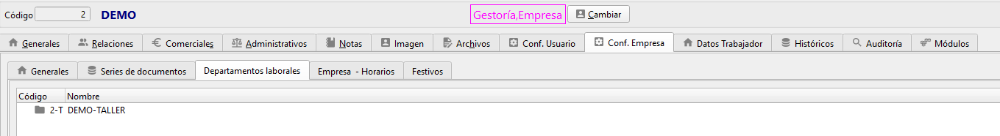

# Regalo a un cliente - ¿Cómo puedo hacerlo?

Nuestro objetivo comercial es entregar un regalo a un cliente que simplemente vaya asociado a una pérdida del coste del regalo a un vehículo \(si no es asociado a un vehículo sólo tenemos que obviar la asociación\).

En primer lugar tendremos que crear una serie de albarán de ventas interno si no está ya creada. 

Configuración &gt; Series &gt; Nueva Serie:

Los únicos requisitos a modificar son en la pestaña "Parámetros" activar "Permite Aplicar a Vehículos" y en la pestaña "Contabilidad", desactivar "Serie Regulada" y activar "Serie Interna" tal y como se ve en la siguiente imagen:

Tras pulsar "Aceptar" es imprescindible cerrar y abrir de nuevo la aplicación.

Ahora damos de alta un albarán de ventas nuevo y asignamos la nueva serie creada AVI, añadimos cliente, el vehículo del cliente \(en la parte de la derecha, debajo de tipo de pago y vencimiento\) y el artículo a regalar:

Al facturar este documento interno, irá a nombre de la empresa sin precio, ya que todo es pérdida.

Para facturar de forma interna, de nuevo creamos una serie nueva llamada FVI \(Factura de Ventas Interna\) en la que, al igual que el AVI \(Albarán de Ventas Interno\) desmarcamos "Regulada" y activamos "Interna" en la pestaña contabilidad:

En el AVI \(Albarán de Ventas Interno\) asociamos la serie de factura que acabamos de crear \(FVI\) y pulsamos en "Aceptar". Recuerda que cada vez que se crea una serie nueva tenemos que cerrar y abrir la aplicación.

En caso de no querer asociarlo a un vehículo, simplemente no rellenamos ese campo.

