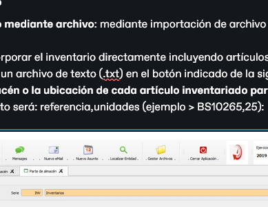

# Stocks vehículos

La primera opción que nos muestra el menú comercial nos presenta una rejilla con un filtrado automático de vehículos por marca, presentando la cabecera de cada una seguida de los vehículos pertenecientes a la misma, situación de los vehículos (stock / reservados) por modelo y totalización de los vehículos al final, indicando la marca, por situación (stock / reservados):

<figure><figcaption></figcaption></figure>

<mark style="color:yellow;">PESTAÑAS</mark>

<mark style="color:blue;">DETALLES (rejilla con la información detallada de marcas y vehículos en stock):</mark>

* Nombre: identifica la marca y los modelos asociados a ella
* Bastidor: identifica el vehículo con su bastidor
* Color: de cada modelo, identifica su color para facilitar el control de stock
* Ubicación: lugar donde se encuentra el vehículo. Puede mostrar el almacén principal, uno de tránsito e incluso el nombre de un agente que tiene el vehículo en depósito:

<figure><figcaption></figcaption></figure>

* Reservado: muestra si el vehículo se encuentra en pre-reserva o reserva en una operación indicando el nombre de la entidad cliente
* Días Stock: indica el número de días que han pasado desde la entrada del vehículo en el stock mediante albarán de compras
* Días Último Movimiento: indica los días que han pasado desde que hubo algún movimiento del vehículo, ya sea entrada al stock, traslados o depósitos.
* Días Vencimiento Cmp (compra): cálculo de días desde hoy hasta la fecha de entrada y salida del vehículo. Es un cálculo interno de la aplicación
* CES (cesión): icono que aparece en este campo indicando si el vehículo se encuentra cedido
* EXT (extras): icono que aparece en este campo indicando si el vehículo tiene extras

<mark style="color:blue;">TOTALES (rejilla con la información relativa al stock en función con el tipo de vehículo, reservas en función del tipo de vehículo, pedidos a proveedor, pedidos a proveedor con reserva, stock disponible y stock previsto (sumas entre los distintos campos que muestra el resultado disponible)):</mark>

<figure><figcaption></figcaption></figure>

* Modelo:
* Stock (nuevos - ocasión - empresa):
* Reservados (nuevos - ocasión - empresa):
* Pedidos a proveedor:
* Pedidos a proveedor reservados:
* Stock disponible:
* Stock Previsto:

<mark style="color:blue;"></mark>

<mark style="color:blue;"></mark>

<mark style="color:blue;"></mark>

