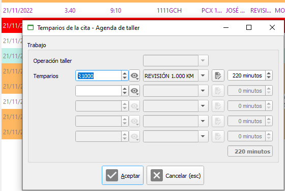

# Modificación de tempario y tiempo de cita

Modificación tempario y de tiempo total en cita ya dada de alta (pulsar en el tiempo indicado en la línea de la cita para ver el formulario):

<figure><figcaption></figcaption></figure>

<figure><figcaption>
Edición de tempario y tiempo total a taller
</figcaption></figure>
