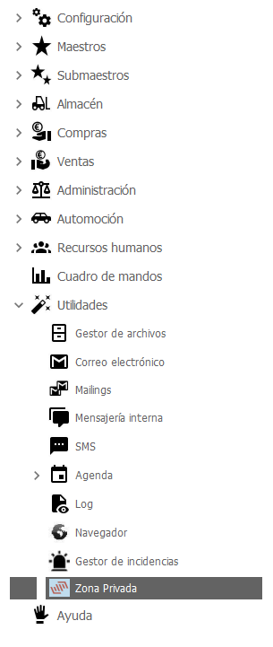

# Perfiles

## Permisos / Perfiles

Los permisos se definen en los perfiles de usuarios. **A cada usuario solo se le puede definir un perfil.**

**Es fundamental que para activar una opción dentro de los perfiles, el nivel principal RAÍZ esté activado. Para sólo activar el raíz seleccionamos y pulsamos en el botón "Editar configuración". Después podremos ir activando las opciones individualmente. Por ejemplo, si ese perfil debe tener acceso a Usuarios, debe tener permiso para acceder a Configuración.**

<mark style="color:yellow;">**\*\*\* En caso de estar activada alguna opción y no estar activada la RAÍZ no se verá ninguna opción en el panel de opciones lateral izquierdo.**</mark>

Podemos acceder a este menú desde Configuración → Permisos / Perfiles → Perfiles

<figure><figcaption></figcaption></figure>

Para crear un nuevo perfil, pulsamos botón derecho del ratón y pulsamos en "Alta de Perfil" y aparecerá el siguiente formulario:

<figure><figcaption></figcaption></figure>

La siguiente imagen muestra el menú de los perfiles desde donde se pueden dar y quitar permisos a un perfil en concreto sobre el alta, baja y modificación de opciones concretas.

<figure><figcaption></figcaption></figure>

El pestaña "Especiales" muestra permisos especiales que permitirán activar opciones dentro del programa.

<figure><figcaption></figcaption></figure>

Para aplicarle a un usuario un perfil, debemos ir a la ficha de usuario. Configuración → Usuarios. Dentro de la ficha del usuario elegir el perfil correspondiente.

<figure><figcaption></figcaption></figure>

La tabla de perfiles es "arbolada", por lo que podremos ordenar estos usando la nomenclatura del árbol como inicial y las ramas usarán dicha nomenclatura, añadiéndole como mínimo un carácter más.Permisos según el “Nivel del usuario”- **SUPERVISOR**

· Barra de opciones

<figure><figcaption></figcaption></figure>

\*\*\* Permisos específicos:

* Pestaña estadísticas de documentos de venta
* Listados analíticos en el panel de tesorería
* Ver el costo en líneas de albaranes de venta
* Consulta de auditorías de documentos, maestros y eventos
* Eventos: borrado
* Ver los cierres de cuentas de tesorería
* Abrir facturas
* Abrir un asiento de caja
* Abrir una remesa

Entidades

* Rejilla de opciones especiales de entidades
* Modificar dirección de la empresa
* Editar ficha de la empresa
* Ver pestaña de configuración del operario de una entidad
* Ver pestaña de configuración web de entidades

\- **MEDIO**· Barra de opciones

<figure><figcaption></figcaption></figure>

\*\*\* Permisos específicos

* Botón “Desbloquear “ en el formulario de pedidos de venta.

\- **BÁSICO**· Barra de opciones

<figure><figcaption></figcaption></figure>
