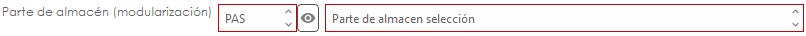

# Escandallo

#### Modularización

<mark style="color:red;">**Vídeo modularización - parte de almacén automático:**</mark>



La **modularización de artículos** permite gestionar productos compuestos de forma automática en el momento de su entrada en almacén.

Con esta opción, es posible comprar un producto “padre” (por ejemplo, una caja de bujías) y que, al confirmar su entrada en stock, el sistema registre automáticamente la entrada de las unidades individuales que contiene (cada bujía), en lugar de almacenar la caja como una única unidad.

De este modo:

* Se compra en formato agrupado.
* Se almacena en formato unitario.
* El movimiento de stock se genera de forma automática.
* Se mantiene el control real de existencias.

**Configuración necesaria**

Para que la modularización funcione correctamente, es necesario realizar dos configuraciones:

1. Configuración de la serie del albarán de compras.
2. Configuración del artículo padre.

### Configuración de la serie

Dentro de Series de Albaranes de Compras, encontrarás un nuevo campo:

**Parte de almacén (Modularización)**

<figure><figcaption></figcaption></figure>

En este campo debes indicar la serie de parte de almacén que se utilizará para generar automáticamente los movimientos de stock derivados de la modularización.


Este paso es obligatorio.
\
Si no se configura este campo, el programa no podrá generar el parte de almacén automáticamente al confirmar el albarán.


### Configuración del artículo padre

En el artículo que actuará como producto padre y en la pestaña escandallo encontrarás una nueva opción llamada:

* Modularización

Para añadir módulos:

1. Haz doble clic en el área en blanco.
2. Se abrirá un formulario de configuración.

<figure><figcaption></figcaption></figure>

Campos del formulario

* **Artículo hijo**\
  Aquí se indica el artículo que se generará en stock como resultado de la modularización.
* **Unidades generadas**\
  Indica cuántas unidades del artículo hijo se generarán por cada 1 unidad del artículo padre.

### Funcionalidad

Una vez configuradas la serie y la modularización del artículo:

1. Se genera un albarán de compras.
2. Se incluye un artículo que tenga configurada modularización.
3. Se confirma el albarán.

**Resultado automático**

Al confirmar:

* Se genera automáticamente un **parte de almacén.**
* En dicho parte:
* Se resta del stock el artículo padre según las unidades indicadas en el albarán.
* Se suman al stock las unidades de los artículos hijos según la cantidad definida en su configuración.

Con esta funcionalidad se automatiza la descomposición de productos comprados en formato agrupado, evitando procesos manuales y garantizando un control preciso del stock.

 
