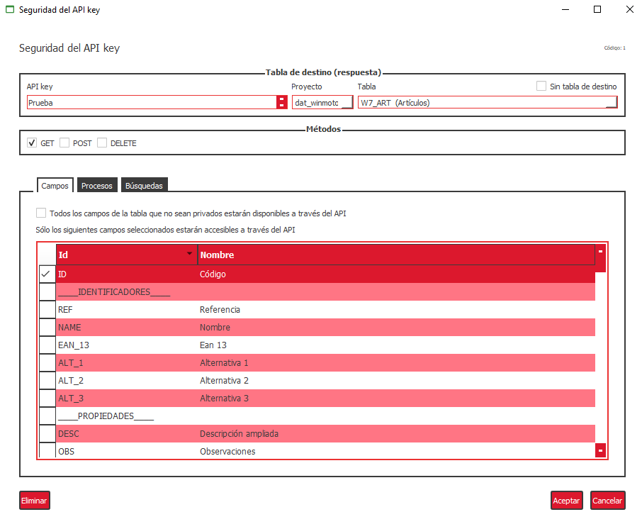
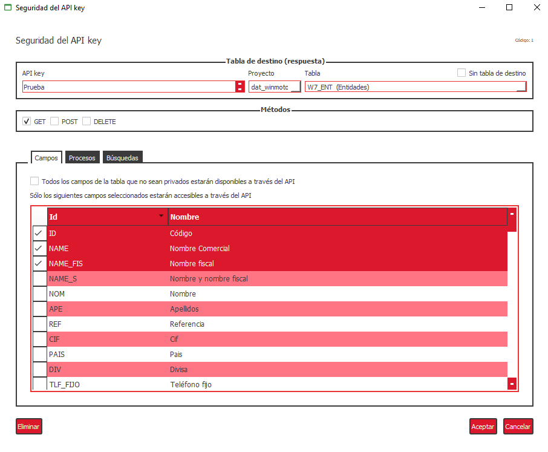
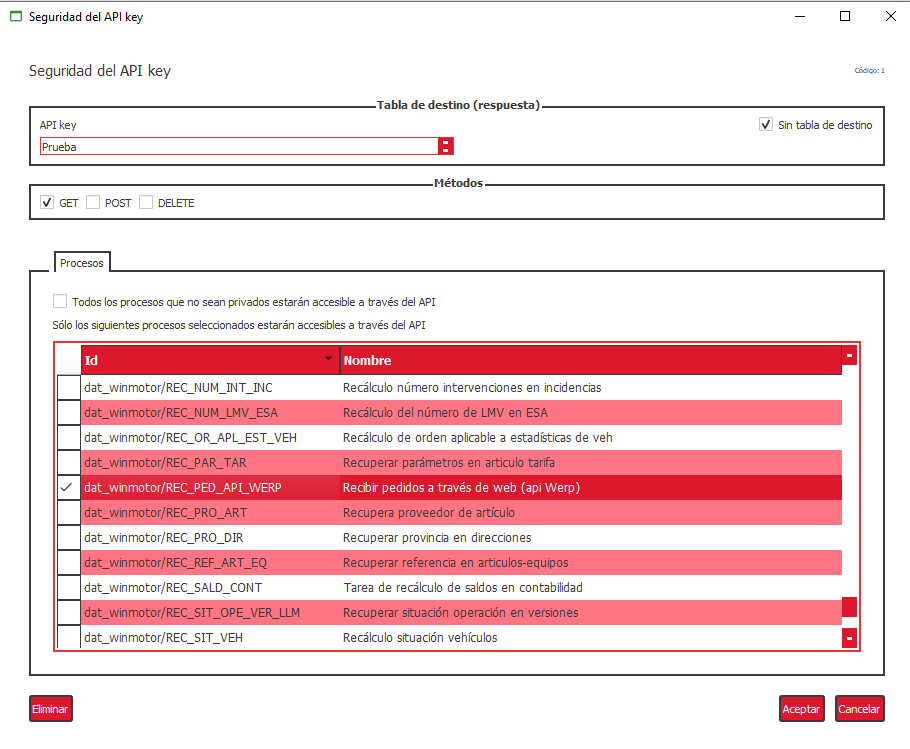

# Ejemplos

Indicaremos una serie de ejemplos para poder hacer una serie de consultas concretas:

* Sacar un artículo:

[http://IP_DOMINIO/empresa/dat_\__winmotor\__dat/v1/w7\_art?filter%5Bid%5D=1&api\_key=ABC123](http://91.126.70.127/BOTANICA/vERP_2_dat_dat/v1/w7_art?filter%5Bid%5D=1&api_key=ABC123)

* Lista de artículos:

  [http://](http://91.126.70.127/BOTANICA/vERP_2_dat_dat/v1/w7_art?&api_key=ABC123)[IP_DOMINIO/empresa/dat_\__winmotor\__dat](http://91.126.70.127/BOTANICA/vERP_2_dat_dat/v1/w7_art?filter%5Bid%5D=1&api_key=ABC123)[/v1/w7\_art?&api\_key=ABC123](http://91.126.70.127/BOTANICA/vERP_2_dat_dat/v1/w7_art?&api_key=ABC123)

* Sacar un artículo solo con imagen en base64

  [http://](http://185.185.52.127/BOTANICA/vERP_2_dat_dat/v1/w7_art?filter%5Bid%5D=1&api_key=ABCD1234)[IP_DOMINIO/empresa/dat_\__winmotor\__dat](http://91.126.70.127/BOTANICA/vERP_2_dat_dat/v1/w7_art?filter%5Bid%5D=1&api_key=ABC123)[/v1/w7\_art?filter%5Bid%5D=1&api\_key=ABCD1234](http://185.185.52.127/BOTANICA/vERP_2_dat_dat/v1/w7_art?filter%5Bid%5D=1&api_key=ABCD1234)

* Litar 10 entidades:

[http://](http://91.126.70.127/BOTANICA/vERP_2_dat_dat/v1/w7_ent?page%5Bnumber%5D=1&page%5Bsize%5D=10&api_key=ABC123)[IP_DOMINIO/empresa/dat_\__winmotor\__dat](http://91.126.70.127/BOTANICA/vERP_2_dat_dat/v1/w7_art?filter%5Bid%5D=1&api_key=ABC123)[/v1/w7\_ent?page%5Bnumber%5D=1&page%5Bsize%5D=10&api\_key=ABC123](http://91.126.70.127/BOTANICA/vERP_2_dat_dat/v1/w7_ent?page%5Bnumber%5D=1&page%5Bsize%5D=10&api_key=ABC123)

* Creación de pedido:

 [http://](http://91.126.70.127/BOTANICA/vERP_2_dat_dat/v1/_process/REC_PED_API_HER?param[lin]=LA91000403$UD1&param[nif]=B41377649&param[tip_ped]=pr&api_key=ABC123)[IP_DOMINIO/empresa/dat_\__winmotor\__dat](http://91.126.70.127/BOTANICA/vERP_2_dat_dat/v1/w7_art?filter%5Bid%5D=1&api_key=ABC123)[/v1/\_process/REC\_PED\_API\_HER?param\[lin\]=LA91000403$UD1&param\[nif\]=B41377649&param\[tip\_ped\]=pr&api\_key=ABC123](http://91.126.70.127/BOTANICA/vERP_2_dat_dat/v1/_process/REC_PED_API_HER?param[lin]=LA91000403$UD1&param[nif]=B41377649&param[tip_ped]=pr&api_key=ABC123)

