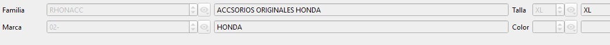
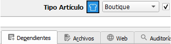
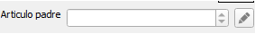

# Artículos simples y combinaciones

Para entender cómo funciona la sincronización de productos entre el ERP (Winmotor) y la tienda online (PrestaShop), primero hay que distinguir dos tipos de artículo:

* Producto simple: un artículo independiente, que no depende de ningún otro. Por ejemplo, un casco de una talla y color únicos o un producto básico.
* Producto combinado (o "combinación"): un artículo que en realidad es una variante (talla, color, etc.) de un producto más general. Por ejemplo, una chaqueta que existe en varias tallas y colores: cada talla/color es una combinación distinta, pero todas pertenecen al mismo producto "base".

En PrestaShop, este segundo caso se gestiona con un producto padre (la chaqueta, en general) y varias combinaciones hijas (chaqueta en talla M, chaqueta en talla L, etc.), cada una con su propio stock y su propia referencia.

## Cómo se sincroniza cada tipo

### Productos simples

No requieren ninguna preparación especial. Se sincronizan directamente desde Winmotor y se crean en la tienda online tal cual.

### Productos combinados

<figure><figcaption></figcaption></figure>

Para que un producto se sincronice correctamente como combinación, tienen que cumplirse tres condiciones en Winmotor:

1. #### El tipo de artículo debe permitir combinaciones

No todos los tipos de artículo (boutique, accesorios, recambios, etc.) pueden funcionar como combinaciones. Hay que habilitar expresamente esta posibilidad para cada tipo de artículo en Winmotor. Actualmente, en el entorno de pruebas, solo está habilitado para artículos de tipo Boutique. La opción a activar será si es dependiente o no el tipo de artículo.

<figure><figcaption></figcaption></figure>

2. #### Hay que indicar cuál es el producto padre

En Winmotor, cada artículo "hijo" (una talla o color concreto) debe tener especificado cuál es su artículo "padre" (el producto general). Esto se indica directamente en la ficha del artículo hijo.

Ejemplo: el artículo CHAQUETA es el padre. Los artículos CHAQUETA L y CHAQUETA M son sus hijos, y cada uno debe tener marcado que su padre es CHAQUETA.

<figure><figcaption></figcaption></figure>

3. #### El stock se gestiona en las combinaciones, no en el padre

En la tienda online, el producto padre no tiene stock propio: su stock es la suma del stock de todas sus combinaciones (hijos). Por eso el control de existencias real se hace a nivel de cada talla/color, no del producto general.

### El punto más importante: colores y tallas deben estar "casados" con la web

Este es el requisito que más frecuentemente puede dar problemas si no se prepara de antemano.

**¿Por qué?** Cuando Winmotor sincroniza un artículo como combinación, necesita decirle a PrestaShop _a qué color o talla exacto de la web_ corresponde. Para eso, cada color y cada talla dados de alta en Winmotor debe tener guardado el **código con el que ese mismo color o talla existe en PrestaShop.**

Esos códigos se pueden consultar en la propia tienda online, en **Catálogo → Atributos y características.**

**¿Qué pasa si un color o talla no tiene ese código guardado?**

El sistema intenta localizarlo automáticamente por el nombre y, si lo encuentra, guarda el código para que a partir de ese momento quede resuelto. Pero no siempre es fiable (nombres escritos de forma distinta, tildes, mayúsculas, etc. pueden hacer que no se encuentre la coincidencia). Si no se localiza, el artículo no podrá subirse correctamente como combinación.

<figure><figcaption></figcaption></figure>

**Recomendación:** antes de empezar a sincronizar productos combinados, se debe hacer un **casamiento inicial manual:** revisar todos los colores y tallas de Winmotor y comprobar que cada uno tiene su código de la web correctamente informado. Así se evita tener que corregir artículos uno a uno más adelante.

<figure><figcaption></figcaption></figure>

### Resumen de la checklist antes de sincronizar combinaciones

| Requisito                                              | Dónde se comprueba                                                                                    |
| ------------------------------------------------------ | ----------------------------------------------------------------------------------------------------- |
| El tipo de artículo permite combinaciones              | Configuración de tipos de artículo en Winmotor                                                        |
| El artículo hijo tiene su padre correctamente indicado | Ficha del artículo en Winmotor                                                                        |
| Cada color usado tiene su código de la web guardado    | Ficha de colores en Winmotor (consultable en ficha de artículos) / Catálogo → Atributos en PrestaShop |
| Cada talla usada tiene su código de la web guardado    | Ficha de tallas en Winmotor / Catálogo → Atributos en PrestaShop                                      |

Si alguno de estos puntos falla, el producto no se podrá crear correctamente en la tienda como combinación, aunque el resto de sus datos (precio, stock, referencia) estén bien.
