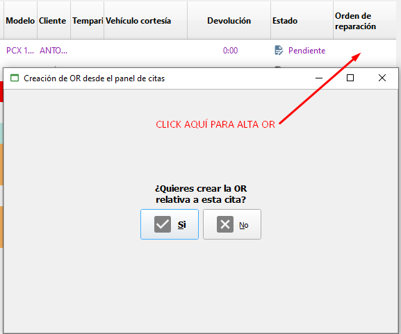

# Estadísticas de Pedidos

La opción estadísticas de pedidos permite filtrar las exclusivamente pedidos de ventas y añade el resto de características de los menús de estadísiticas de ventas y compras como filtros de marca, proveedor, artículo, familia y tipo de artículo (imagen 2) y añadir nuevos filtros por artículo, servicio o ambos, intervalo de fecha y filtrado por serie, además de permitir crear agrupaciones de filtrado por proveedor, familia, artículo, marca, tipo de artículo e importes (pestaña "Filtros y agrupaciones - Imagen 4) mostrando posteriormente listados con el documento, su fecha, referencia y descripción, unidades, su precio, descuentos y los parciales, haciendo en la parte inferior de la rejilla el sumatorio de compras, unidades y parcial:

<figure><figcaption></figcaption></figure>

El alta de nuevo filtro muestra el siguiente formulario donde podemos observar que se centra en fecha y serie de pedidos de ventas:

<figure><figcaption></figcaption></figure>
