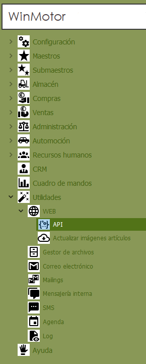
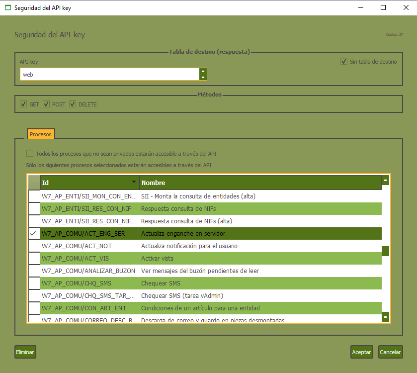
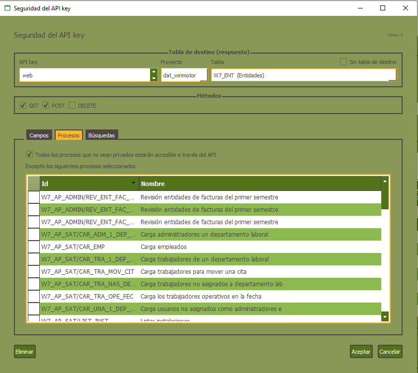
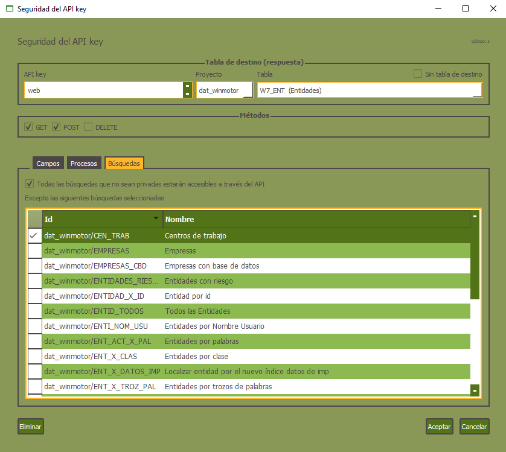

# Web - Documentación API REST

**Winmotor incorpora un API REST** de forma opcional que permite acceder vía HTTP al contenido de todas las tablas, procesos y búsquedas que existen en la aplicación y por supuesto, seleccionar únicamente aquellos a los que dar acceso.

**Disponer de esa tecnología significa que tu aplicación está abierta al mundo y permite a un desarrollador dar soluciones basadas en tu aplicación** y sus datos como:

* Aplicaciones para dispositivos móviles.
  * iOS
  * Android
  * Windows Mobile
  * iPadOS
* Aplicaciones web.
  * Tiendas online con Prestashop , Magento , WOOCommerce , etc usando sus APIs.
  * Conexión con plugins WordPress
  * Catálogos de productos, servicios, tarifas de precios y cualquier desarrollo que te puedas imaginar

## Ejecutar la aplicación y configurar la seguridad 

La seguridad del API REST está basada en 2 capas actualmente:

* Capa 1: clave API key.
* Capa 2: configuración de seguridad a nivel de tablas, campos, procesos y búsquedas.

La capa 1 consiste en una clave definible por el programador o el usuario en tiempo de ejecución que se configura desde el menú Supervisor -&gt; API keys.

Al ejecutar esta opción se muestra el formulario de menú de API keys

Podemos crear tantos registros como queramos, en cada registro de API key debemos grabar una descripción y el valor de la clave del API key.

En la pestaña seguridad del API key podremos generar tantos registros como tablas tenemos en nuestros proyectos de datos más un registro para los objetos poder configurar la seguridad de los procesos que no tienen tabla destino declarada.

En el formulario se puede configurar con el check si es para procesos sin tabla destino, una vez marcado sólo nos aparecerá la pestaña de procesos.

En la parte superior izquierda tenemos 4 checks para configurar si este API key soporta los métodos GET, PUT, POST y DELETE.

En caso de no marcar el check sin tabla nos aparecerán 3 pestañas para configurar la seguridad de campos, procesos y búsquedas.

Para seleccionar un proceso, lo que debemos seleccionar en los combo boxes son el proyecto de datos donde está tabla de destino y la tabla de destino.

En el caso de configurar una tabla debemos seleccionar un proyecto de datos de todos los cargados en ejecución y una vez seleccionado el proyecto podremos elegir la tabla sobre la que vamos a configurar la seguridad.

De igual modo podemos configurar en la parte superior derecha los métodos aceptados para dicha tabla \(GET, PUT, POST y DELETE\).

Las tres pestañas de seguridad de campos procesos y búsquedas tiene la misma funcionalidad y usabilidad.

Por defecto el API REST no permitirá devolver información de un campo, proceso o búsqueda que tengan marcado el estilo **privado**.

En la de campos tenemos un check que nos permite indicar si queremos que todos los campos de la tabla que no sean privados estén disponibles para el API. Conviene marcarlos si queremos que estén accesibles la mayoría de campos, en ese caso los campos que seleccionemos en la rejilla inferior serán excluidos del retorno de información que genere el API.

Los campos que devolverá el JSON al ejecutar el proceso son los que se marquen en la pestaña **campos** del API, que no hay que programar nada en el proceso.

Si queremos dejar accesible un número pequeño de campos es mejor no marcar el check y hacer la selección de los campos accesible. En definitiva lo que se trata es de seleccionar de la lista el menor número de elementos utilizando el check para dicho fin.

Los procesos y las búsquedas funcionan igual con un check que permite seleccionar todas excluyendo las seleccionadas o solo incluir las seleccionadas si no marcamos el check.

### Probar el API desde Swagger 

#### ¿Qué es Swagger? 

Swagger es estándar para definir interfaces de API REST que permite que tanto personas como máquinas puedan entender y comprender las capacidades de un servicio sin acceder al código fuente o una documentación específica. Actualmente swagger forma parte de la especificación OpenApi.

El API REST de Velneo genera dinámicamente un fichero de definición swagger del API disponible en tu aplicación.

Para acceder a Swagger usa la siguiente url: [https://demoapi.velneo.com/swagger\_old/](https://demoapi.velneo.com/swagger_old/)

Verás que al cargar la página propone la url de acceso a la instancia web que tenemos de la demo de Velneo vERP \([https://demoapi.velneo.com/verp-api/vERP\_2\_dat\_dat/swagger](https://demoapi.velneo.com/verp-api/vERP_2_dat_dat/swagger)\) y nos pide que introduzcamos la APIKey. En el caso de la demo de vERP ésta es: api123

Así ya podrás comprobar cómo funciona. En caso de querer probar con nuestra url simplemente habrá que indicarla \(https://DOMINIO/dat\__winmotor\_dat/_v1/w7\_art?filter%5Bid%5D=1\) con su api: api123.

**Doble factor de validación**

Tras mostrarse la interfaz de Swagger, es necesario conocer el nombre de la API y asignarla a la variable “api\_name”. Una vez comprobada su validez, se mostrarán los recursos disponibles y será necesaria la validación del “api\_key” para usarlos.​


Si bien Swagger requiere [CORS](https://es.wikipedia.org/wiki/Intercambio_de_recursos_de_origen_cruzado) \(\(Cross-Origin-Resource-Sharing\) si usamos el API Rest de Velneo vERP no es necesario activarlo en Apache, pues las propias cabeceras de nuestra API Rest ya lo activan directamente.


