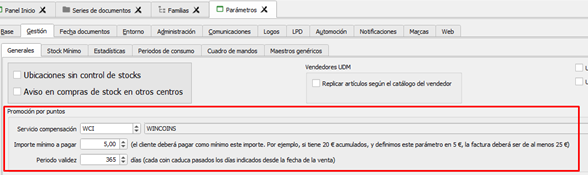

# Wincoins

1.- <mark style="color:orange;">**Información:**</mark>

Se trata de controlar en la aplicación la gestión de puntos que se acumularán por cada venta, y que servirán para aplicar en futuras ventas como descuento de la misma.

Por defecto el nombre de la "moneda" será Wincoins pero cada empresa podrá establecer el nombre que más le interese.

* Se puede definir una cuota de aplicación en series de albaranes de venta, OR y facturas de venta. Y como añadido, se podrá tanto en familias como en artículos definir una cuota de aplicación o puntos por unidad
  * Prevalece lo definido en el artículo, luego lo definido en la familia, y por último lo de la serie. Se podrá por ejemplo solo definir una cuota de aplicación por serie y no definir ni en artículos ni familias. En series es imprescindible definir.
* Por otro lado, se podrán compensar puntos, es decir, hacer descuento, solo en las series de albaranes de venta, OR o facturas que marquemos: "descuentos aplicables".
* Cada Wincoin acumulado equivale siempre a 1 euro. Si tengo 7 Wincoins acumulados, descontaremos en la venta 7 euros.
* Se podrá parametrizar los tipos de entidad a los que se excluye la aplicación de Wincoins. Esta acción solo la podrá realizar Winmotor.
* Se podrán excluir líneas de venta puntales de la aplicación de Wincoins. Para ello hay un nuevo check en líneas de documento "excluir Wincoins".
* Los abonos de las ventas que generaron Wincoins descontarán saldo en el monedero del cliente.
* Los abonos de las ventas que consumieron Wincoins devolverán el saldo consumido al monedero del cliente.
* En el ticket o factura, se indicarán los puntos descontados en esa venta, así como el saldo actual del cliente.
  * Esto está pendiente de que nos indiquen en que parte del informe añadir.
* Cada venta que acumule saldo registrará la fecha de la venta y tendrá un periodo de validez definido en parámetros.
  * Si tenemos definido que el periodo de validez son 365 días, y el cliente ha realizado dos compras, la caducidad quedará así:
    * Venta 15 enero, 5 Wincoins, caducan el 14 de enero del año siguiente.
    * Venta 20 mayo, 7 Wincoins, caducan el 19 de mayo del año siguiente.

2.-  <mark style="color:orange;">**Configuración a realizar:**</mark>

* &#x20;Cuota de aplicación en series, familias (opcional) y artículos (opcional)
* Marcar en que series se aplica descuentos.
*   Parámetros a rellenar:

<figure><figcaption></figcaption></figure>

3.- <mark style="color:orange;">**Funcionamiento:**</mark>

* Si por ejemplo hemos rellenado en la serie AV una cuota de aplicación del 2%, por cada línea grabada el programa calculará automáticamente un 2% sobre la base en Wincoins.
* Se podrá consultar los Wincoins aplicados en cada línea y totales con el botón situado en la parte inferior "Wincoins"
* Se podrá disponer de esos Wincoins en cualquier otra venta de serie donde hayamos marcado "descuentos aplicables". Para ello nos aparecerá un botón "compensar saldo". Al pulsarlo nos aparecerá un botón con la base del documento, los Wincoins disponibles, y el importe a aplicar. Podemos seleccionar como máximo ese importe, pero también podremos aplicar menos. En ese mismo formulario hay un botón para ver en detalle el saldo, así como el histórico (por si queremos ver líneas caducadas, consumidas, etc.). Si aceptamos este formulario con un importe positivo, se creará una nueva línea en el documento con el servicio parametrizado.
* En los clientes, hay un nuevo botón para ver el saldo y el histórico de Wincoins .png>)

<figure><figcaption></figcaption></figure>

* En el panel de entidades hay un nuevo botón para sacar listado de clientes con saldo, el detalle del saldo, etc.

<figure><figcaption></figcaption></figure>

4.- <mark style="color:orange;">**API:**</mark>

* **OBTENER ID CLIENTE POR TELEFONO**
  * **URL:** http://IP\_DOMINIO/NOMBRE\_INSTANCIA/dat\_winmotor\_dat/v1/W7\_ENT?api\_key=XXX\&filter\[TELEFONOS\_TODOS]=666888111
  * Simplemente habrá que indicar el número de teléfono. IP\_DOMINIO es el dominio o IP del servidor y la api\_key será la que vendrá especificada en Winmotor en Utilidades.
* **OBTENER WINCOINS BY ID CLIENTE**
  * **URL:** http://IP\_DOMINIO/NOMBRE\_INSTANCIA/dat\_winmotor\_dat/v1/W7\_ENT?api\_key=XXX\&filter\[ID]=2
  * En la respuesta se informará del saldo de la entidad.
* **CAMBIAR EMAIL CLIENTE BY ID CLIENTE**
  * **URL:** [http://IP\_DOMINIO/NOMBRE\_INSTANCIA/dat\_winmotor\_dat/v1/\_process/MOD\_EMA\_CLI\_X\_ID?param\[id\_cli\]=1\&param\[ema\]=prueba2@gmail.com](http://ip\_dominio/NOMBRE\_INSTANCIA/dat\_winmotor\_dat/v1/\_process/MOD\_EMA\_CLI\_X\_ID?param\[id\_cli]=1\&param\[ema]=prueba2@gmail.com)\&api\_key=XXX
  * ID\_CLI es el ID (código) del cliente) y EMA es el email de la entidad.
* **RESTAR / SUMAR WINCOINS BY ID CLIENTE**
  * **URL:** http://IP\_DOMINIO/NOMBRE\_INSTANCIA/dat\_winmotor\_dat/v1/\_process/WCI\_ACT\_WIN\_COI?param\[CLI]=1\&param\[UDS]=200\&api\_key=XXX
  * CLI = obligatorio, código o id del cliente.
  * UDS = obligatorio, unidades de Wincoins a sumar o restar.
  * FEC\_CAD = es opcional y solo para el caso de sumar. Es la fecha de caducidad que tendrá esas unidades de Wincoins. Si no se pasa este parámetro se calculará según el parámetro definido en la aplicación de nº de días de caducidad de los Wincoins y la fecha de "hoy".
* **CONSULTAR HISTÓRICO WINCOINS DE CLIENTE**
  * **URL:** http://IP\_DOMINIO/NOMBRE\_INSTANCIA/dat\_winmotor\_dat/v1/W7\_WIN\_COI?api\_key=1234\&filter\[ENT]=6618
  * Se podrá solicitar a winmotor el histórico de movimientos registrados de un cliente donde han intervenido wincoins (ya sea para añadir saldo o para restar) indicando el ID del cliente del que queremos consultar el histórico.
  *   Winmotor nos devolverá todos los movimientos de wincoins realizados con la siguiente información en cada registro:

      * ID: código único del movimiento
      * LIN: código único de la línea de documento en la que se aplica wincoins.
      * CAB: código único del documento en el que se aplica wincoins
      * ENT: código único de la entidad consultada
      * FEC\_ALT: fecha de alta del movimiento
      * FEC\_CAD: fecha de caducidad del saldo
      * ORI: indica si se ha calculando en base a la serie, la familia o el artículo.
      * ORI\_WXU: wincoins aplicados por unidad
      * ORI\_CUO: cuota de cálculo
      * WCI\_ACU: wincoins acumulados
      * WCI\_CON: wincoins consumidos
      * WCI\_SAL: saldo de wincoins
      * ACT: si el saldo está activo o no

      (Habrá que activar la tabla W7\_WIN\_COI@dat\_winmotor en la sección API para poder hacer las consultas.)

Información extra:

Para activar la API relativa a Wincoins habrá que ir al programa (Utilidades > WEB > API) y activar los siguientes procesos que indicamos a continuación para poder ejecutar esas acciones vía API:

* WCI\_ACT\_WIN\_COI@dat\_winmotor
* MOD\_EMA\_CLI\_X\_ID@W7\_AP\_COMU
* W7\_WIN\_COI@dat\_winmotor
